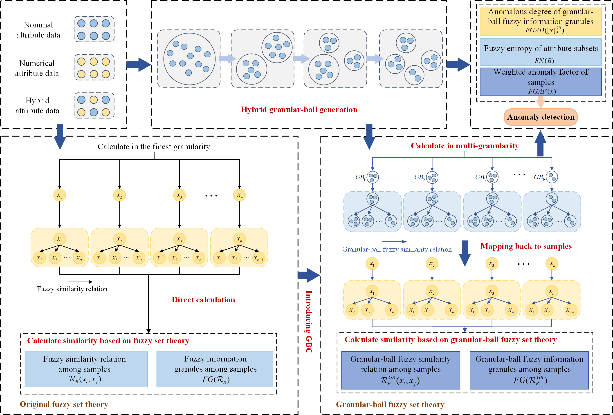

# HGBAD
Xinyu Su, Xiwen Wang, Dezhong Peng, Hongmei Chen, Yingke Chen, and **Zhong Yuan***,[Granular‑ball computing guided anomaly detection for hybrid attribute data](Paper/2024-HGBAD.pdf), International Journal of Machine Learning and Cybernetics, 2024, DOI: [10.1007/s13042-024-02425-8](https://doi.org/10.1007/s13042-024-02425-8).

## Abstract
Anomaly detection is one of the important research areas in data mining or data analytics. However, most of the existing anomaly detection methods struggle with homogeneous data that includes both nominal and numerical attribute data. Moreover, these methods also suffer from inefficiency and noise sensitivity due to their single-granularity sample-based input paradigm. In this study, we propose an unsupervised anomaly detection method based on the granular-ball fuzzy set called HGBAD. First, we define a novel granular-ball fuzzy set to deal with the uncertainty information in hybrid attribute data. Based on the novel fuzzy set, multiple granular-ball fuzzy information granules are constructed. The anomaly degrees of granular-ball fuzzy information granules are fused to calculate the anomaly factors. The anomaly factors are used to measure the anomaly degrees of samples. Based on the anomaly factors, anomalies can be detected by an anomaly determination threshold. Experimental results demonstrate the superior performance of HGBAD in detecting anomalies across various data types. The code is publicly available at https://github.com/Mxeron/HGBAD.
## Framework


## Usage
You can run HGBAD.py:
```python
if __name__ == '__main__':
    data = pd.read_csv("./Example.csv").values
    out_factors = HGBAD(data, 0.6)
    print(out_factors)
```
You can get outputs as follows:
```
out_factors = [0.37513644 0.40236464 0.34346751 0.39648027 0.36365423 0.34144782
 0.38701767 0.38893099 0.38578651 0.34648678 0.35439573 0.37120788
 0.35991082 0.33280241 0.3308039  0.35823686 0.34502298 0.36494364
 0.36962932 0.35060029]
```
## Citation
If you find DFNO useful in your research, please consider citing:
```
@article{yuan2024detecting,
  title={Granular‑ball computing guided anomaly detection for hybrid attribute data},
  author={Su, Xin Yu and Wang, Xiwen and Peng, Deng Zhong and Chen, Hong Mei and Chen, Ying Ke and Yuan, Zhong},
  journal={International Journal of Machine Learning and Cybernetics},
  volume={},
  number={},
  pages={},
  year={2024},
  doi={10.1007/s13042-024-02425-8},
  publisher={Springer}
}
```
## Contact
If you have any questions, please contact yuanzhong@scu.edu.cn.
